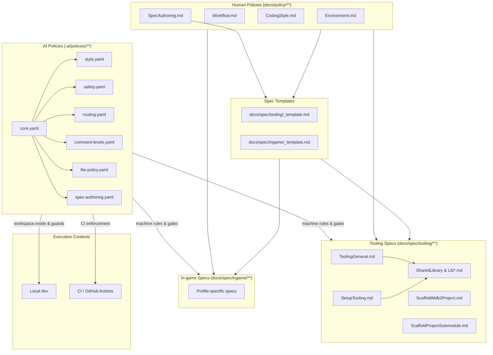
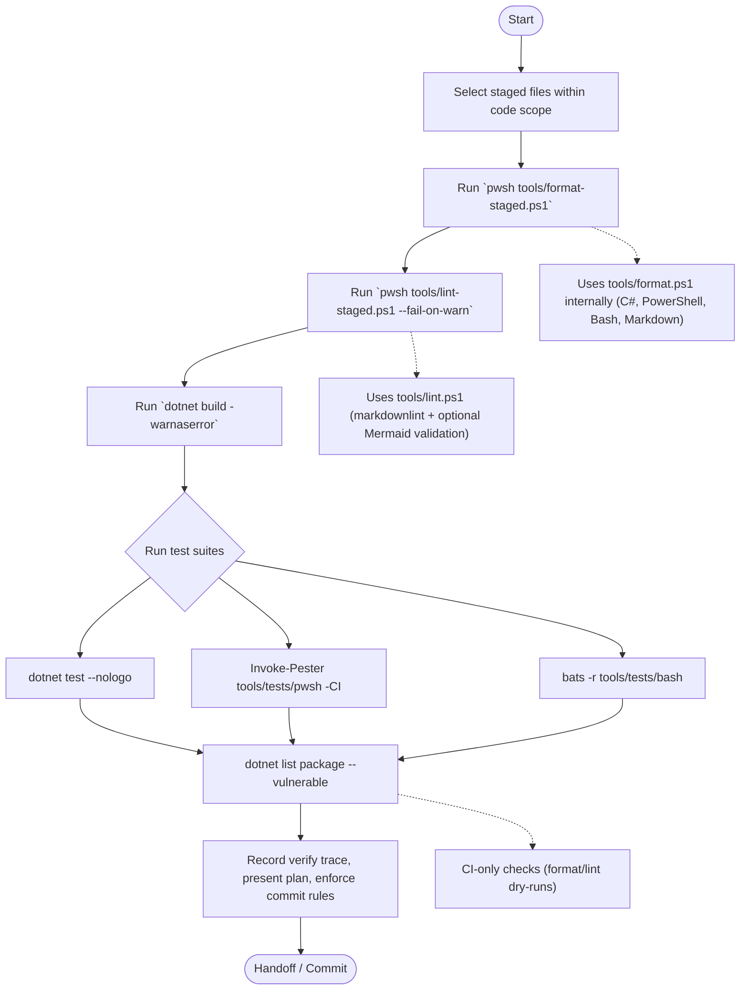
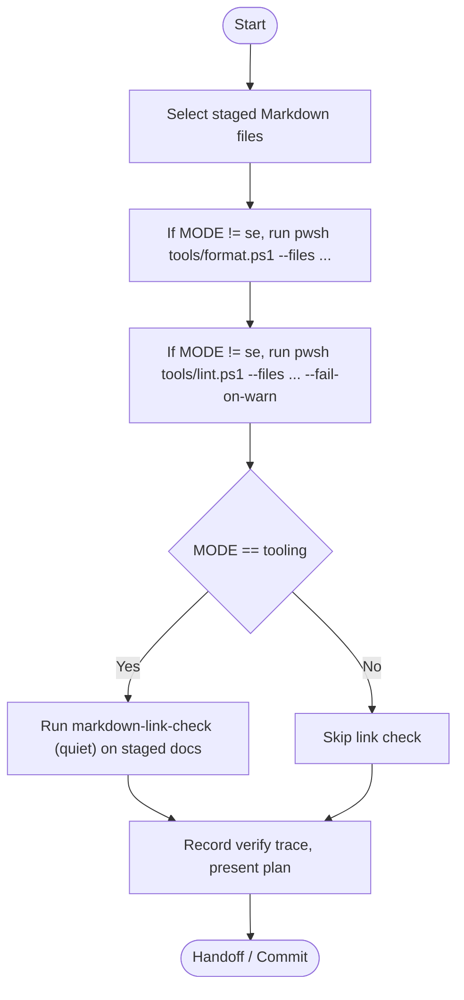
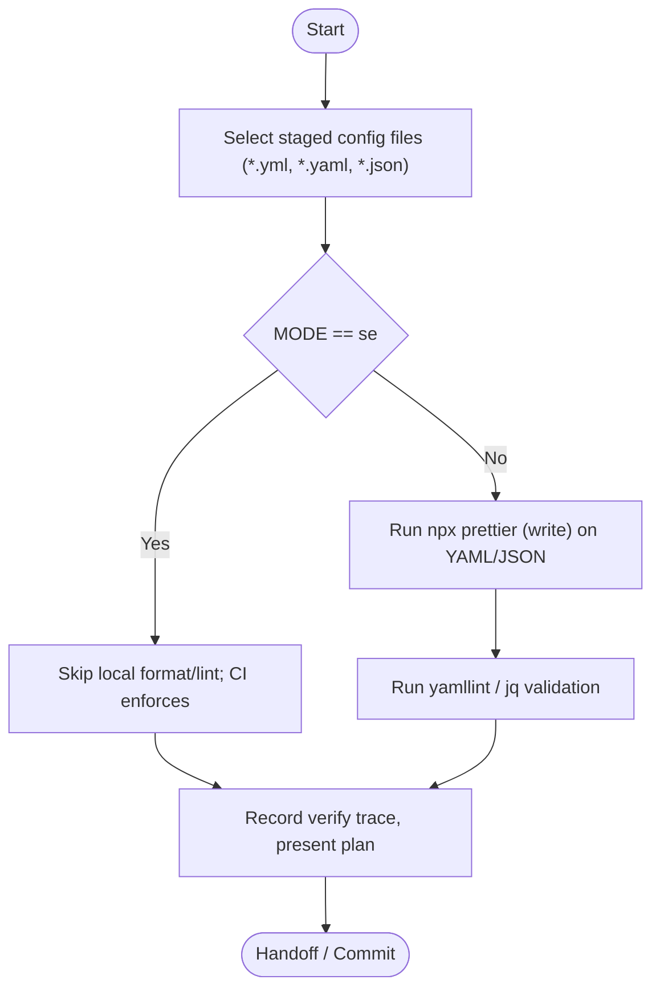

> Tone: second person, active, imperative; precise and concise.

# Workflow Policy

This policy describes how the maintainer (human developer) and the AI assistant collaborate on the dev-framework project.

## Policy Relationships

Use the following diagram to understand how human-authored policies, AI machine rules, templates, and runtime contexts interact. The AI policies shown under `.ai/policies/` include both the primary rule files and the supporting configuration files (`comment-levels.yaml`, `file-policy.yaml`) that Core loads.

## Collaboration Loop

1. **Context Share** – Developer provides repository state, priorities, and constraints. AI confirms understanding and surfaces clarifying questions when information is ambiguous.
2. **Scope Agreement** – Before executing commands or edits, AI drafts a short plan; developer can adjust or veto steps. Plans are tracked in conversation using the plan tool.
3. **Spec-First Changes** – For tooling or architecture work, AI checks that an approved specification exists. Missing or outdated specs are updated with developer sign-off before implementation proceeds.
4. **Incremental Work** – AI performs changes in small batches, validating after each significant action (e.g., running `Get-Content`, generating files). No destructive commands without explicit developer approval.
5. **Review & Handoff** – AI summarizes modifications referencing file paths and open questions. Developer reviews, requests adjustments, or approves next tasks.

## Communication Guidelines

- Developer remains the gatekeeper for decisions; AI avoids assumptions when requirements are unclear.
- AI records unknowns and follow-ups in spec "Open Questions" or TODOs so context is preserved.
- All tooling that may modify developer environment (installs, git operations) must prompt the developer unless explicitly forced via CLI switch or instruction.

## Documentation & TODO Hygiene

- When tasks complete, AI updates `docs/TODO.md` and relevant specs/policies to prevent drift.
- Every specification change must append a dated entry to its changelog so the history remains traceable.
- New ideas or deferred decisions belong in the appropriate spec section 9 or Supporting Documentation notes, ensuring future visibility.

## Commit Messages

- Format subject lines as `<scope[/sub-scope]>: summary` in lowercase (e.g. `tooling/setup: implement bash script`).
- Use imperative summary text without trailing punctuation; keep the line within 72 characters.
- Only add a body when extra context is essential; wrap additional lines at 72 characters.
- Choose scopes that describe the touched area (`tooling`, `docs/tooling`, `policy/workflow`, etc.).

## Test-first mode (tooling)

- For new features or changes to scripts under `tools/`, write or update tests **first** (Bats/Pester), then implement code to make tests pass.
- For regressions, add a failing test that reproduces the issue, then fix to green.
- Prefer component-style tests that exercise script entry points (flags/inputs) rather than internal helpers.
- `--help`/`--version` output **must** be stable and parseable in tests; `--dry-run` paths **must** have no side effects.
- Bash-based tests may invoke Python helpers for JSON parsing. Ensure an interpreter (`python3`, `python`, or `py -3`) is visible on `PATH` (or exported via `PYTHON`/`PYTHON_CMD`) before running suites locally or in CI.

## Workflow Diagrams

The Mermaid diagrams below capture the “golden order” implemented in `.ai/workflows/*.yaml`. Each node lists the command executed at that step; helper scripts (`tools/format*.ps1`, `tools/lint*.ps1`) route through our shared formatter/linter logic. Branches highlight conditional behaviour (e.g., CI-only checks).

### Code Workflow (`.ai/workflows/code.yaml`)

### Docs Workflow (`.ai/workflows/docs.yaml`)

### Config Workflow (`.ai/workflows/config.yaml`)

## Verification

- After each edit, AI verifies the change by re-reading or diffing the affected file (e.g., `Get-Content`, `rg`, `git diff`) before proceeding.
- The verification step must capture the exact command or diff snippet in the handoff so future reviewers can trace what was inspected.
- AI reports commands run, highlights failed attempts, and proposes manual validation steps the developer can perform.
- Significant workflow changes require developer acknowledgment in this document before adoption.
